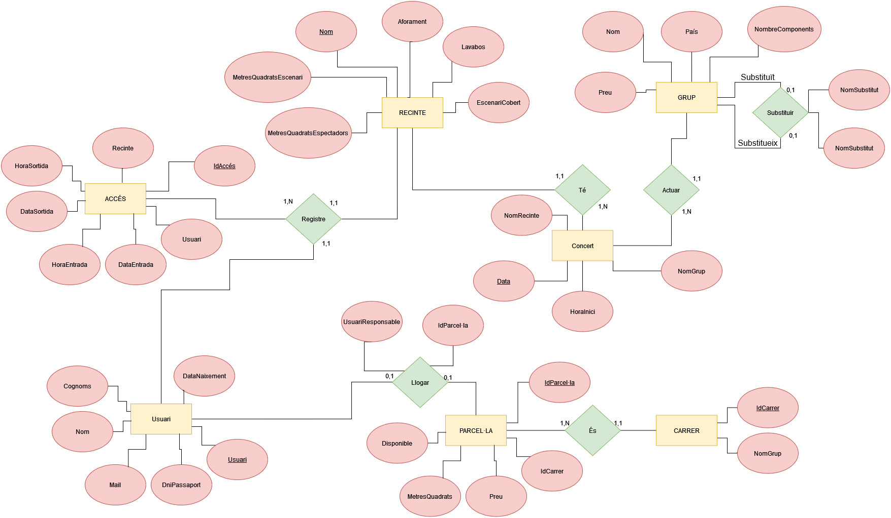

# Entitats i Atributs

## Recinte
Un recinte està identificat per un nom únic i inclou la següent informació: superfície de l'escenari en metres quadrats, superfície destinada als espectadors en metres quadrats, aforament màxim, disponibilitat de lavabos i si l'escenari està cobert o descobert.    

    Recinte (Nom (PK), MetresQuadratsEscenari, MetresQuadratsEspectadors, Aforament,Lavabos ,EscenariCobert)

## Grup
Un grup està identificat per un nom únic i inclou les següents dades: país d'origen, preu per actuació, grup al qual pot substituir en cas de ser un grup substitut, i si és el grup principal en nom del substitut.    

    Grup(Nom (PK), País, NombreComponents, Preu, NomPrincipal, NomSubstitut)
        on NomPrincipal Referència Grup(NomGrup)
        on NomSubstitut Referència Grup(Nom)

## Concert
Un concert es defineix per una data, el nom del grup que hi actua, el recinte on es realitza i l’hora d'inici.   

    Concert(Data (PK), NomGrup (FK), IdRecinte (FK), HoraInici)
        on NomGrup Referència Grup(Nom)
        on NomRecinte Referència Recinte(Nom)

## Carrer
Un carrer està identificat per un codi únic i inclou també el seu nom.

    Carrer(IdCarrer (PK), NomGrup)

## Parcel·la
Una parcel·la està identificada per un codi únic i inclou el codi del carrer al qual pertany, la superfície en metres quadrats, el preu i l’estat de disponibilitat. 

    Parcel·la(IdParcel·la (PK), IdCarrer (FK), MetresQuadrats, Preu, Disponible)
        on IdCarrer Referència Carrer(IdCarrer)

## Persona
Un usuari està identificat per un nom d'usuari únic i inclou una contrasenya, DNI o passaport, adreça de correu electrònic, nom, cognoms i data de naixement.

    Persona(Usuari (PK), Contrasenya, DniPassaport, Email, Nom, Cognoms, DataNaixement)

## Lloguer
Un lloguer està identificat per un identificador únic i inclou l’identificador de la persona que fa el lloguer i l’usuari responsable de la reserva.  

    Lloguer(IdLloguer (PK), IdParcel·la (FK), UsuariResponsable (FK))
        on IdParcel·la Referència Parcel·la(IdParcel·la)
        on UsuariResponsable Referència Ususari(Usuari)

## Accés
Un accés està identificat per un identificador únic i inclou l’usuari que ha realitzat l’accés, el recinte al qual ha accedit, la data i hora d’entrada, així com la data i hora de sortida.

    Accés(IdAcces (PK), Usuari (FK), IdRecinte (FK), DataEntrada, HoraEntrada, DataSortida, HoraSortida)
        on IdUsuari Referència Ususari(IdUsuari)
        on IdRecinte Referència Recinte(IdRecinte)

# Model Relacional

